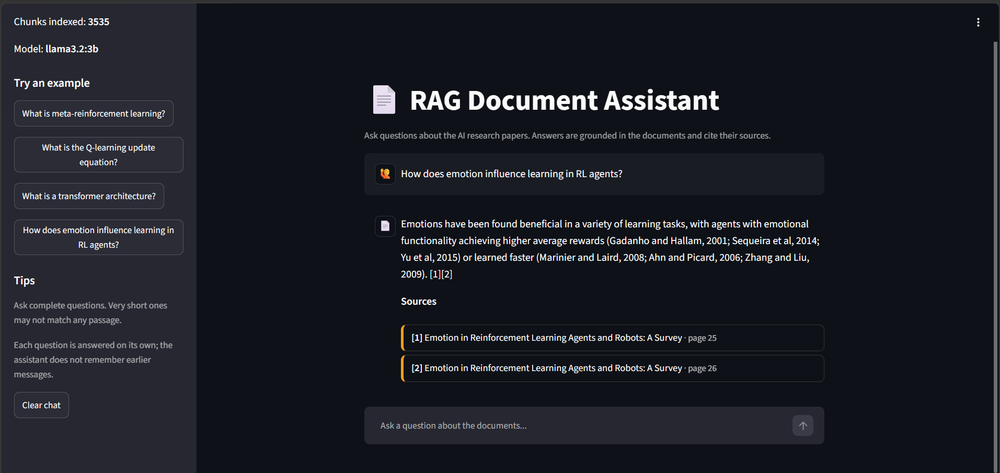
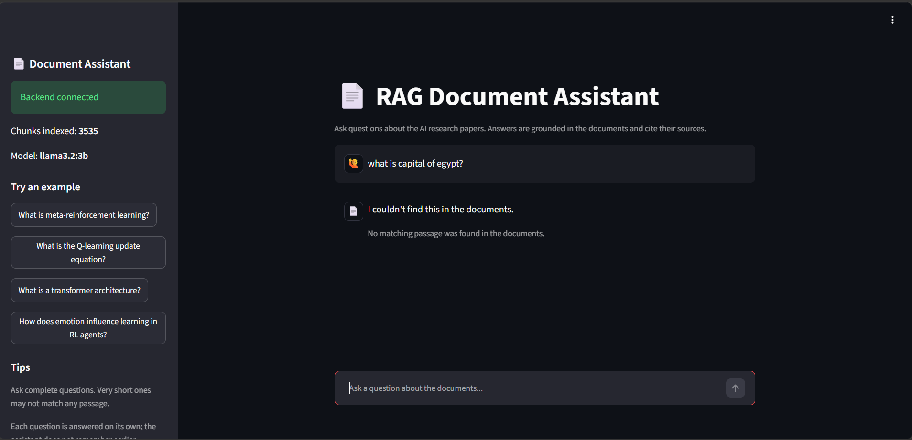
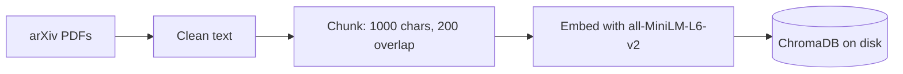
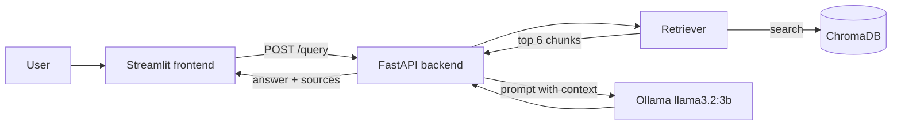

# RAG Document Assistant

A retrieval-augmented generation (RAG) assistant that answers questions about a collection of AI research papers. Every answer is grounded in the retrieved passages and cites the paper and page it came from. Questions the documents cannot answer are refused instead of being answered from the model's own knowledge.

Everything runs locally: embeddings with `sentence-transformers`, vector search with ChromaDB, generation with a local [Ollama](https://ollama.com) model, a FastAPI backend and a Streamlit chat frontend.

> Level 2 Summer Training graduation project (Core Track, text only).

## Screenshots





## Architecture

Offline pipeline (built once in `notebooks/rag_pipeline.ipynb`):



Online flow (every question):



How a question is handled:

1. The request is validated (`question` must be 3 to 500 characters, otherwise `422`).
2. The question is embedded and searched in ChromaDB. Only the best chunk per page is kept, up to 6 chunks.
3. If the best similarity score is below `0.45`, the assistant refuses.
4. The chunks and the question go to the local LLM with a prompt that allows answering only from the context.
5. The answer is cleaned, and the sources are **computed in code**, not taken from the model: a chunk counts as a source only if it shares 4-word phrases with the answer. If no chunk does, the assistant refuses.

## Tech stack

| Part | Technology |
|---|---|
| Embeddings | `sentence-transformers`, `all-MiniLM-L6-v2` (384 dimensions) |
| Vector store | ChromaDB (persistent, cosine similarity) |
| LLM | Ollama, `llama3.2:3b`, temperature 0 |
| Chunking | LangChain `RecursiveCharacterTextSplitter` |
| Backend | FastAPI, Pydantic, pydantic-settings, Uvicorn |
| Frontend | Streamlit |
| Tests | pytest, FastAPI `TestClient` |
| Packaging | Docker (backend) |

## Project structure

```
rag-assistant-app/
├── notebooks/
│   └── rag_pipeline.ipynb        # load, clean, chunk, embed, retrieve, evaluate, export
├── backend/
│   ├── app/
│   │   ├── main.py               # FastAPI app, CORS, startup loading (lifespan)
│   │   ├── api/routes/query.py   # GET /health, POST /query
│   │   ├── core/config.py        # settings from .env and rag_config.json
│   │   ├── schemas/query.py      # QueryRequest / QueryResponse
│   │   ├── services/
│   │   │   ├── retrieval.py      # load vector store, retrieve chunks
│   │   │   └── generation.py     # prompt, Ollama call, source attribution
│   │   └── utils/logging_config.py
│   ├── data/
│   │   ├── rag_config.json       # settings exported by the notebook
│   │   ├── titles.json           # arXiv file name -> paper title
│   │   └── vector_store/         # built by the notebook (not in the repo)
│   ├── tests/test_query.py
│   ├── requirements.txt
│   ├── .env.example
│   └── Dockerfile
├── frontend/
│   ├── app.py                    # Streamlit chat UI
│   ├── api_client.py             # wrapper for the backend API
│   ├── requirements.txt
│   └── .env.example
├── download_data.py              # downloads the papers into data/raw
├── download_extra.py             # adds "Attention Is All You Need" and BERT
├── fetch_titles.py               # builds backend/data/titles.json
├── check_data.py                 # checks that the PDFs have extractable text
└── data/raw/                     # PDFs (not in the repo)
```

## Domain and data

- **Domain:** AI research papers.
- **Corpus:** 32 arXiv PDFs. `download_data.py` collects about 30 papers from arXiv searches (large language models, computer vision, reinforcement learning, NLP, machine learning surveys). `download_extra.py` adds two more (Attention Is All You Need, BERT), because the first set had no paper explaining the transformer.
- **Not in the repo:** the PDFs (83 MB) and the vector store (67 MB) are too large, so they are excluded in `.gitignore`. Follow the setup steps below to download the papers and build the store.
- **Extraction:** all PDFs are text-extractable, no OCR was needed.
- **Cleaning:** ligatures normalized (NFKC), hyphenated line breaks rejoined, broken lines merged, repeated page headers and footers removed.
- **Reference sections removed:** bibliographies and author lists matched many question words and crowded out real content, so chunks that look like references are dropped before embedding.
- **Chunks:** 4017 chunks after splitting, around 3535 stored after removing references (1000 characters, 200 overlap, split per page so every chunk keeps `source` and `page`).

The paper set may differ slightly if you re-run the download, because arXiv search results change over time. `titles.json` covers the original 32 papers; a paper without a title is shown by its file name.

## Setup

Requirements: Python 3.10+, [Ollama](https://ollama.com), Git. Developed on Python 3.14 (Windows); the Docker image uses Python 3.12.

### 1. Clone and create a virtual environment

```bash
git clone https://github.com/rAmeZ-m/rag-assistant-app.git
cd rag-assistant-app
python -m venv .venv
.venv\Scripts\activate          # Windows
# source .venv/bin/activate     # macOS / Linux
```

### 2. Install Ollama and the model

```bash
ollama pull llama3.2:3b
```

Make sure Ollama is running (`http://localhost:11434` shows "Ollama is running").

### 3. Download the papers and build the vector store

Run these from the repo root:

```bash
pip install jupyter pandas numpy chromadb sentence-transformers pypdf ollama python-dotenv arxiv langchain-text-splitters
python download_data.py
python download_extra.py
jupyter notebook
```

Open `notebooks/rag_pipeline.ipynb` and run **Kernel > Restart & Run All**. It writes `backend/data/vector_store/` and `backend/data/rag_config.json`. The first run downloads the embedding model (about 90 MB) and takes a few minutes.

### 4. Run the backend

```bash
pip install -r backend/requirements.txt
cd backend
uvicorn app.main:app --reload
```

Open <http://localhost:8000/docs> to try the API. `GET /health` should report around 3535 chunks.

### 5. Run the frontend

In a second terminal (with the virtual environment active):

```bash
pip install -r frontend/requirements.txt
cd frontend
copy .env.example .env          # Windows  (cp .env.example .env on macOS / Linux)
streamlit run app.py
```

Open <http://localhost:8501>.

### Docker (optional, backend only)

Build the vector store first (step 3), then:

```bash
cd backend
docker build -t rag-backend .
docker run --rm -p 8000:8000 rag-backend
```

The container reaches Ollama on the host through `host.docker.internal`. This was tested with Docker Desktop on Windows. The container still contacts huggingface.co when it starts, so it needs an internet connection. If you rebuild the vector store, build the image again.

### Tests

```bash
cd backend
pytest -v
```

Needs the vector store and a running Ollama. The suite has 4 tests: health, a happy-path question, an out-of-scope question that must be refused, and invalid input (`422`).

## Environment variables

Backend (`backend/.env`, optional, see `backend/.env.example`):

| Variable | Default | Description |
|---|---|---|
| `OLLAMA_HOST` | `http://localhost:11434` | Address of the Ollama server |
| `CORS_ORIGINS` | `http://localhost:8501,http://localhost:7860` | Allowed frontend origins, comma separated |
| `LOG_LEVEL` | `INFO` | Logging level |
| `VECTOR_STORE_DIR` | `backend/data/vector_store` | Location of the ChromaDB store |

On the author's Windows machine, ChromaDB failed to load the index from a folder path containing non-English characters. Setting `VECTOR_STORE_DIR` to a copy in an English path fixed it.

Frontend (`frontend/.env`, see `frontend/.env.example`):

| Variable | Default | Description |
|---|---|---|
| `API_BASE_URL` | none (required) | Backend URL, for example `http://localhost:8000` |

## API reference

### `GET /health`

```json
{"status": "ok", "chunks": around 3535, "llm_model": "llama3.2:3b"}
```

### `POST /query`

Request body: `{"question": "..."}` (3 to 500 characters).

```bash
curl -X POST http://localhost:8000/query \
  -H "Content-Type: application/json" \
  -d '{"question": "What is meta-reinforcement learning?"}'
```

Response:

```json
{
  "answer": "Meta-reinforcement learning (meta-RL) considers a family of machine learning (ML) methods that learn to reinforcement learn. That is, meta-RL methods use sample-inefficient ML to learn sample-efficient RL algorithms, or components thereof. As such, meta-RL is a special case of meta-learning, with the property that the learned algorithm is an RL algorithm. [1]",
  "sources": ["[1] A Tutorial on Meta-Reinforcement Learning (page 6)"]
}
```

When the documents do not contain the answer, the response is `"I couldn't find this in the documents."` with an empty `sources` list.

| Status | Meaning |
|---|---|
| `200` | Answer or refusal |
| `422` | Invalid question (empty, too short or too long) |
| `503` | The language model is unavailable (is Ollama running?) |

## Evaluation

16 questions, checked manually against the retrieved chunks. Questions 1 to 10 were used while tuning the pipeline (threshold, number of chunks, prompt). Questions 11 to 16 were asked afterwards and were not used for tuning. Question 7 counts as out of scope because "retrieval-augmented generation" only appears in the corpus as a framework name and in a reference.

| # | Question | Retrieved source | Result |
|---|---|---|---|
| 1 | What is reinforcement learning? | 1705.05172v1, p.3 | Correct |
| 2 | What is the Q-learning update equation? | 1705.05172v1, p.7 | Correct, matches the source equation |
| 3 | What is meta-reinforcement learning? | 2301.08028v4, p.6 | Correct |
| 4 | How does emotion influence learning in RL agents? | 1705.05172v1, p.25-26 | Correct, cites the source's own references |
| 5 | What are large language models? | 2405.11357v3, p.1 | Correct, but reflects the angle of one paper (character understanding) |
| 6 | What is a transformer architecture? | 1706.03762, p.3 | Mostly correct: "two sub-layers" describes the encoder, not the whole architecture |
| 7 | What is retrieval-augmented generation? | none | Correct refusal |
| 8 | What is a convolutional neural network used for? | 2301.00942v1, p.53-54 | Partial: mixes descriptions of different architectures on the same page |
| 9 | Who won the 2022 FIFA World Cup? | none | Correct refusal |
| 10 | What is the capital of France? | none | Correct refusal |
| 11 | What is federated learning? | 2609.02984v1, p.8, 14 | Mostly correct: the last sentence credits the base framework with what p.14 says about its variations |
| 12 | What is masked language modeling? | 2306.06371v1, p.6 | Partial: confuses the encoder-only architecture with the MLM objective |
| 13 | What is a skip connection in a neural network? | 2301.00942v1, p.29 | Correct, the equation is partly garbled by PDF extraction |
| 14 | How is BERT pre-trained? | 1810.04805, p.3 | Partial: correct but incomplete, the section describing the two tasks (p.4) was ranked 8th, outside the top 6 |
| 15 | How do I bake sourdough bread? | none | Correct refusal |
| 16 | Who is the president of Egypt? | none | Correct refusal |

All 5 out-of-scope questions were refused. Of the 11 answerable questions, 6 were correct (one with a caveat), 2 mostly correct and 3 partially correct.

### Failure cases and mitigations

1. **Reference lists crowded out real content.** Author lists and bibliographies filled the top results. Chunks that look like references are now removed before embedding. The first version of the rule deleted a real introduction chunk (meta-RL), so it was tightened.
2. **The 3B model cited wrong sources** (mixed up section and page numbers, wrong chunk numbers). Sources are now computed in code from phrase overlap between the answer and each chunk. If nothing matches, the assistant refuses.
3. **Weak retrieval produced ungrounded answers** (the transformer question before the papers were added). A similarity threshold of 0.45 makes the assistant refuse, and two papers were added to the corpus.
4. **Page headers leaked into answers** (the model turned a header into an invented citation). Repeated header and footer lines are removed before cleaning.
5. **The right chunk was ranked 5th** for a basic question. The assistant now retrieves 6 chunks, one per page, because overlap produced near-duplicate chunks.

## Known limitations

- The threshold (0.45) was chosen on a small set of questions. Short or vague questions can score below it and be refused even when the documents contain the answer (for example "what is the skip connection" scored 0.379, while the full question "What is a skip connection in a neural network?" was answered).
- Each question is answered on its own. The assistant does not remember earlier messages, so follow-ups like "give me more details" are refused.
- The small 3B model sometimes mixes sentences from neighbouring text, answers from the angle of a single paper, or leaves out details that are in a lower-ranked chunk.
- Math and tables are partly garbled by PDF text extraction.
- The evaluation covers 16 questions, so the numbers above are indicative, not a benchmark.

## Author

[rAmeZ-m](https://github.com/rAmeZ-m)
